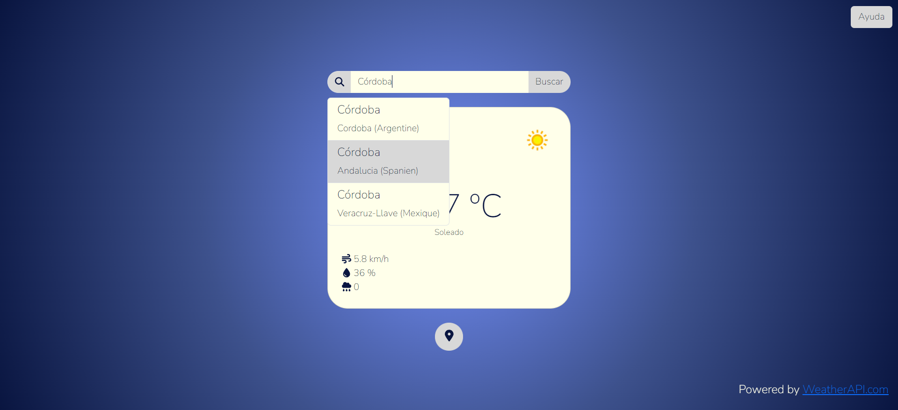

# Aplicación del Tiempo

Aplicación web implementada usando **Vue** para poder ver el tiempo en tu zona y en la zona que quieras.

Los datos meteorológicos han sido extraídos de la siguiente API: https://www.weatherapi.com/

Es importante **generar una key** para poder usar la API. La *key* será introducida en el fichero *utils.js*.

### ¿Cómo funciona?

En primer lugar se te mostrará el tiempo en tu zona.

Luego podrás buscar la ubicación usando la barra de búsqueda:

En caso de que haya más de una coincidencia con tu búsqueda, tendrás que seleccionar la opción que quieras:

(Para poder volver a ver el tiempo en tu ubicación, hay que hacer *click* en el icono inferior)

Adicionalmente, existe un botón de **ayuda** para poder consultar el uso de la página:

## Formatos de entrada

Los resultados de búsqueda no solo admiten los nombres de las localizaciones, también admiten los siguientes tipos de datos

-   **Latitud** y **Longitud**, por ejemplo: q=48.8567,2.3508
-   US zip, por ejemplo: q=10001
-   **Códigos postales del Reino Unido**, por ejemplo: q=SW1
-   **Códigos postales de Canadá**, por ejemplo: q=G2J
-   metar:<metar code>, por ejemplo: q=metar:EGLL
-   iata:<3 digit airport code>, por ejemplo: q=iata:DXB
-   auto:ip por ejemplo: q=auto:ip
-   **Direcciones IP** (IPv4 and IPv6 supported) por ejemplo: q=100.0.0.1
-   Usando las **ID devueltas por Search API**, por ejemplo: q=id:2801268

## Ejecución

Las dependencias del proyecto son:

> @babel/core@7.23.6
@babel/eslint-parser@7.23.3
@fortawesome/fontawesome-svg-core@6.5.1
@fortawesome/free-solid-svg-icons@6.5.1
@fortawesome/vue-fontawesome@3.0.5
@vue/cli-plugin-babel@5.0.8
@vue/cli-plugin-eslint@5.0.8
@vue/cli-service@5.0.8
axios@1.6.2
core-js@3.34.0
eslint-plugin-vue@8.7.1
eslint@7.32.0
mdb-ui-kit@7.1.0
vue@3.3.13

Una vez instaladas las dependencias, ejecutaremos el siguiente fichero.

> run.bat

Que se encuentra en el proyecto para abrir un servidor local en el puerto 8080.
